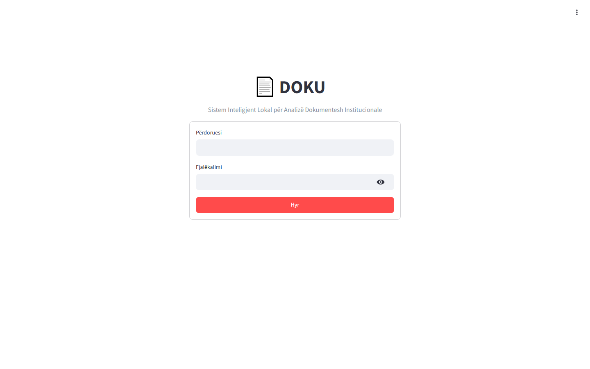
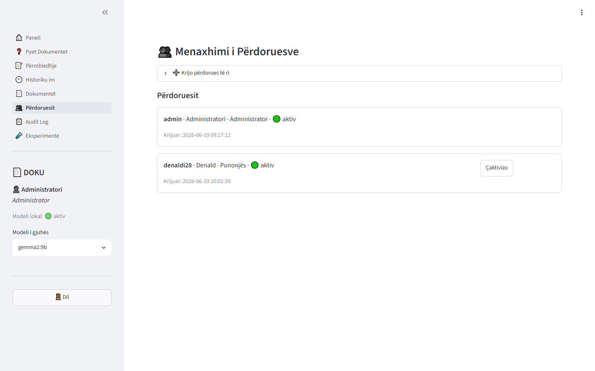
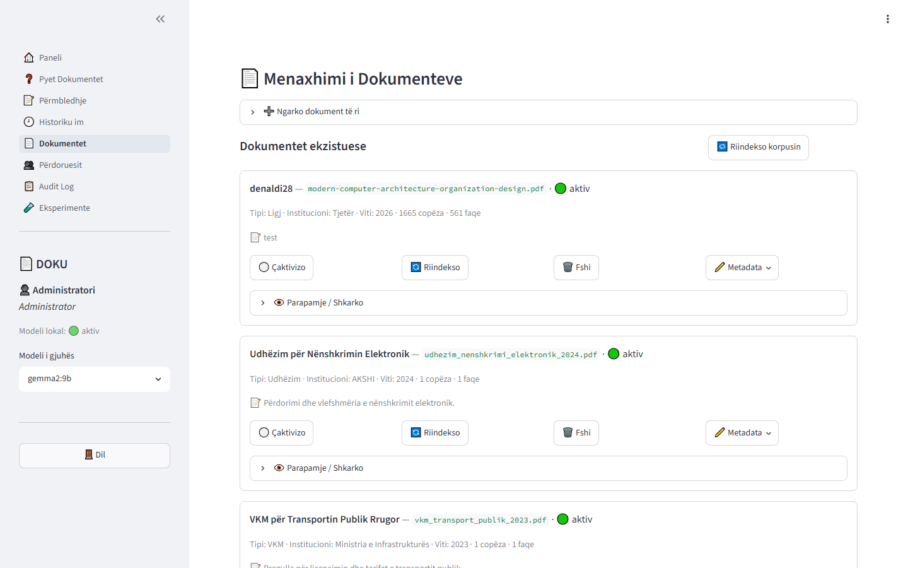
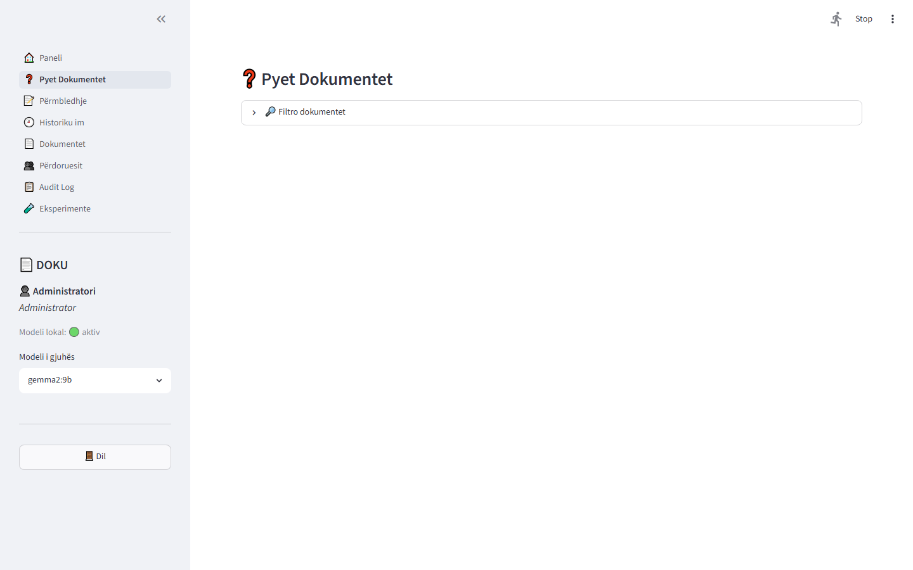
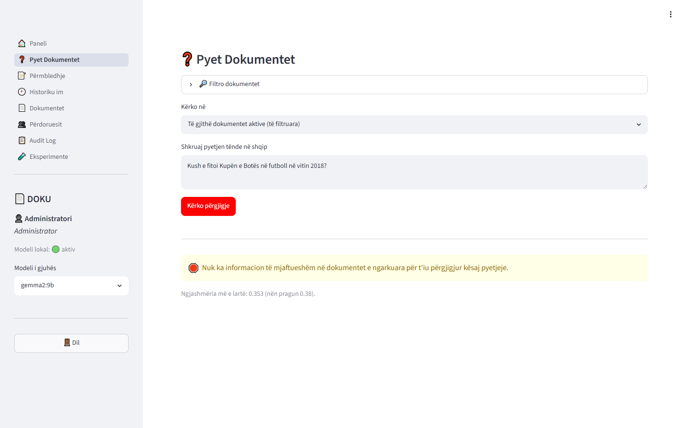
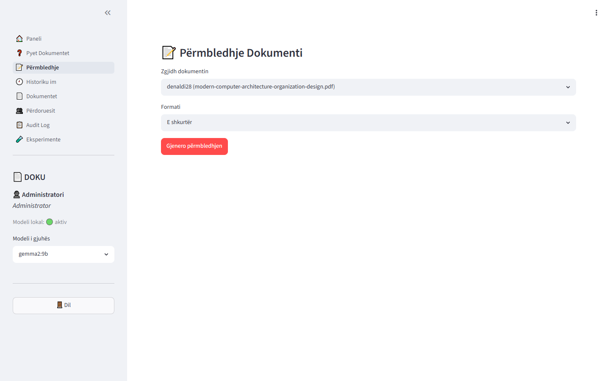
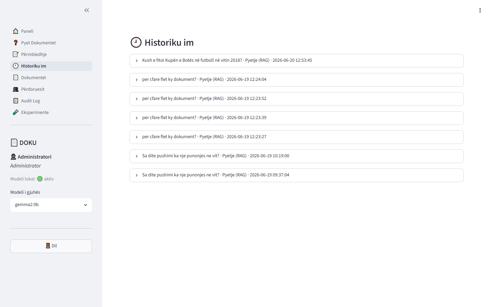
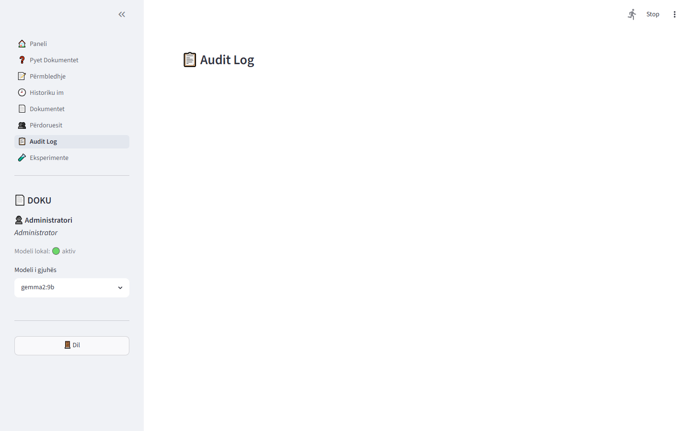
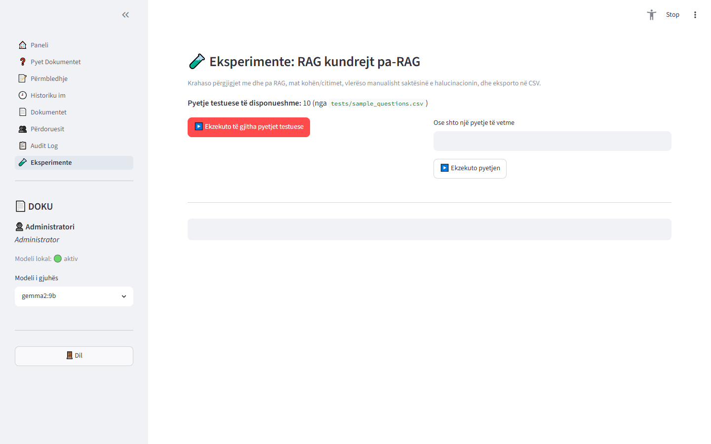
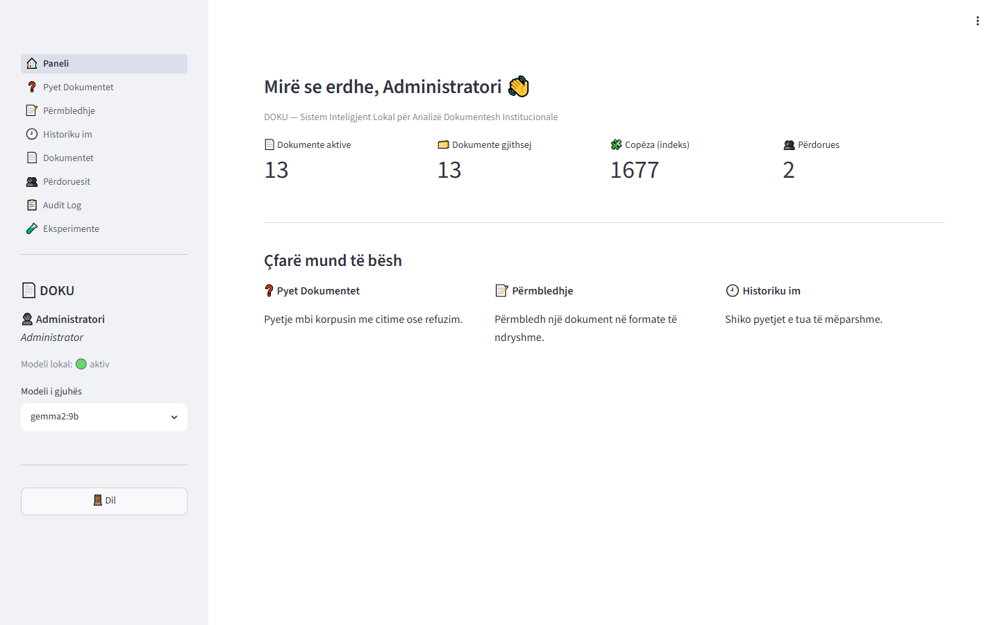

UNIVERSITETI I TIRANËS
FAKULTETI I SHKENCAVE TË NATYRËS
DEPARTAMENTI I INFORMATIKËS


TEMË DIPLOME
Program i Ciklit të Dytë (Master i Shkencave) në Informatikë

Zhvillimi i një sistemi inteligjent për analizë dokumentesh duke përdorur RAG dhe LLM: Aplikimi i tij në institucionet shtetërore në Shqipëri


| Punoi: | Denald Shehaj |
| --- | --- |
| Udhëheqës shkencor: | [Udhëheqësi Shkencor] |


Tiranë, 2026


# Deklaratë Origjinaliteti

Unë, Denald Shehaj, deklaroj se kjo temë diplome me titull «Zhvillimi i një sistemi inteligjent për analizë dokumentesh duke përdorur RAG dhe LLM: Aplikimi i tij në institucionet shtetërore në Shqipëri» është punë origjinale e imja, e realizuar nën udhëheqjen shkencore përkatëse. Çdo material i marrë nga burime të tjera është cituar sipas rregullave akademike. Sistemi softuerik i përshkruar (DOKU) është projektuar dhe zhvilluar tërësisht nga autori. Rezultatet eksperimentale të paraqitura në Kapitullin 6 dhe pamjet nga ekrani janë prodhuar nga vetë sistemi i ekzekutuar mbi një korpus testues dhe nuk janë trilluar.

Nënshkrimi: ____________________        Data: ____________________


# Dedikim

Familjes sime, për mbështetjen e pakushtëzuar gjatë gjithë rrugëtimit akademik.


# Mirënjohje

Dëshiroj të falënderoj udhëheqësin tim shkencor për orientimin dhe sugjerimet e vyera gjatë gjithë procesit të realizimit të kësaj teme. Falënderoj gjithashtu stafin akademik të Departamentit të Informatikës, Fakulteti i Shkencave të Natyrës, Universiteti i Tiranës, për njohuritë e transmetuara. Një falënderim i veçantë shkon për familjen dhe miqtë që më mbështetën moralisht gjatë realizimit të kësaj pune.


# Abstrakt

Institucionet publike në Shqipëri administrojnë një volum të madh dokumentesh ligjore dhe normative — ligje, vendime të Këshillit të Ministrave (VKM), strategji, rregullore dhe udhëzime. Aksesi i shpejtë dhe i saktë në informacionin e tyre është thelbësor për vendimmarrjen institucionale, por kërkimi manual është i ngadaltë dhe i prirur ndaj gabimeve. Modelet e Mëdha Gjuhësore (LLM) ofrojnë ndërveprim në gjuhë natyrore, por vuajnë nga halucinacioni dhe mungesa e burimeve të verifikueshme, çka i bën të rrezikshme në kontekst institucional. Kjo temë paraqet DOKU-n, një sistem inteligjent plotësisht lokal për analizën e dokumenteve institucionale në gjuhën shqipe, i ndërtuar mbi arkitekturën Retrieval-Augmented Generation (RAG) të kombinuar me një LLM që ekzekutohet lokalisht nëpërmjet Ollama. Sistemi indekson dokumentet me embeddings shumëgjuhëshe (bge-m3) në një bazë vektoriale (ChromaDB), zbaton një «portë refuzimi» përpara thirrjes së modelit për të garantuar bazueshmërinë (grounding) dhe shmangur halucinacionet, dhe gjeneron përgjigje të cituara me referenca te dokumenti dhe faqja burimore. DOKU mbështet dy role (administrator dhe punonjës), regjistron çdo veprim në një gjurmë auditi, dhe ofron një modul eksperimentesh që krahason RAG-un kundrejt një LLM-je pa RAG. Vlerësimi empirik mbi një korpus prej 13 dokumentesh dhe 10 pyetjesh tregoi se sistemi prodhoi përgjigje të bazuara me citime për 100% të pyetjeve brenda korpusit dhe refuzoi saktë një pyetje jashtë korpusit në kohë nën një sekondë (pa e thirrur modelin), ndërkohë që LLM-ja pa RAG përgjigjej gjithmonë, edhe pa burim. Rezultatet konfirmojnë vlerën e qasjes RAG për besueshmërinë dhe gjurmueshmërinë e informacionit në kontekst institucional.

Fjalë kyçe: RAG, LLM lokal, ChromaDB, embeddings bge-m3, Ollama, analizë dokumentesh, gjuha shqipe, sektor publik, grounding, halucinacion, kontroll aksesi me role.


# Abstract (English)

Public institutions in Albania manage large volumes of legal and normative documents — laws, Council of Ministers decisions (CMD), strategies, regulations and instructions. Fast and accurate access to their content is essential for institutional decision-making, yet manual search is slow and error-prone. Large Language Models (LLMs) enable natural-language interaction but suffer from hallucination and lack of verifiable sources, which makes them risky in an institutional context. This thesis presents DOKU, a fully local intelligent system for analysing institutional documents in the Albanian language, built on a Retrieval-Augmented Generation (RAG) architecture combined with a locally executed LLM via Ollama. The system indexes documents using multilingual embeddings (bge-m3) in a vector database (ChromaDB), applies a “refusal gate” before invoking the model to guarantee grounding and avoid hallucinations, and produces cited answers referencing the source document and page. DOKU supports two roles (administrator and employee), records every action in an audit trail, and provides an experiment module comparing RAG against a no-RAG baseline. Empirical evaluation on a corpus of 13 documents and 10 questions showed the system produced grounded, cited answers for 100% of in-corpus questions and correctly refused an out-of-corpus question in sub-second time (without invoking the model), whereas the no-RAG LLM always answered, even without a source. The results confirm the value of the RAG approach for the trustworthiness and traceability of information in an institutional context.

Keywords: RAG, local LLM, ChromaDB, bge-m3 embeddings, Ollama, document analysis, Albanian language, public sector, grounding, hallucination, role-based access control.


# Tabela e Përmbajtjes

[Pas hapjes në Microsoft Word: References → Table of Contents → Automatic Table. Word do ta gjenerojë automatikisht nga titujt (Heading 1/2/3). Po ashtu, mund të gjenerohet një Listë Figurash dhe Listë Tabelash nga References → Insert Table of Figures.]


# Kapitulli 1 — Hyrje


## 1.1 Sfondi dhe Konteksti

Transformimi dixhital i administratës publike është kthyer në një prioritet strategjik në Shqipëri, i mishëruar në iniciativa si platforma e-Albania dhe Strategjia Kombëtare për Dixhitalizimin. Megjithatë, pavarësisht dixhitalizimit të shërbimeve, pjesa dërrmuese e njohurisë institucionale vazhdon të ruhet në formën e dokumenteve tekstuale të pastrukturuara: ligje, vendime të Këshillit të Ministrave, strategji sektoriale, rregullore dhe udhëzime. Këto dokumente janë shpesh të gjata, me gjuhë juridike komplekse dhe referenca të ndërsjella, çka e bën gjetjen e informacionit specifik një detyrë të kushtueshme në kohë.
Një punonjës i administratës që kërkon, për shembull, afatin ligjor për dorëzimin e një deklarate ose procedurën e ankimit ndaj një vlerësimi, shpesh duhet të lexojë manualisht dhjetëra faqe. Ky proces është jo vetëm joeficient, por edhe i ndjeshëm ndaj gabimeve interpretuese, të cilat në kontekst institucional mund të kenë pasoja ligjore.
Përparimet e fundit në Inteligjencën Artificiale, veçanërisht Modelet e Mëdha Gjuhësore (LLM), kanë hapur mundësi të reja për ndërveprim në gjuhë natyrore mbi dokumente. Por aplikimi i tyre i drejtpërdrejtë në sektorin publik ndeshet me tri pengesa kryesore: (1) halucinacioni — prirja e LLM-ve për të gjeneruar informacion të pasaktë me ton bindës; (2) mungesa e burimeve të verifikueshme — përgjigjet nuk mund të gjurmohen te një dokument zyrtar; dhe (3) konfidencialiteti — dërgimi i dokumenteve institucionale te shërbime cloud të jashtme bie ndesh me kërkesat ligjore për mbrojtjen e të dhënave. Arkitektura Retrieval-Augmented Generation (RAG) i adreson dy të parat duke e detyruar modelin të përgjigjet vetëm mbi pasazhe të marra nga një korpus i besueshëm, ndërsa ekzekutimi plotësisht lokal adreson të tretën.

## 1.2 Përcaktimi i Problemit

Problemi qendror që adreson kjo temë formulohet si vijon: si mund të ndërtohet një sistem që u mundëson punonjësve të institucioneve shtetërore shqiptare të marrin përgjigje të sakta, të bazuara dhe të verifikueshme nga një korpus dokumentesh zyrtare në gjuhën shqipe, pa rrezikuar konfidencialitetin e të dhënave dhe pa u mbështetur në shërbime cloud të jashtme?
Nga ky problem i përgjithshëm rrjedhin nënproblemet specifike: (a) si të zbutet halucinacioni i LLM-ve në mënyrë strukturore, jo thjesht statistikore; (b) si të garantohet sovraniteti dhe privatësia e të dhënave institucionale; (c) si të trajtohet mbështetja e kufizuar e gjuhës shqipe në shumë mjete komerciale; dhe (d) si të zbatohet një kontroll aksesi me role që ndan qartë administratorin (që menaxhon korpusin) nga punonjësi (që vetëm e pyet atë).

## 1.3 Motivimi dhe Rëndësia

Rëndësia praktike e punës qëndron në mundësimin e një aksesi më të shpejtë dhe më të besueshëm te njohuria institucionale, duke reduktuar kohën e kërkimit dhe rrezikun e gabimit. Rëndësia shkencore qëndron në demonstrimin se një «kontratë bazueshmërie» e zbatuar përpara gjenerimit mund ta bëjë fabrikimin strukturalisht të pamundur për pyetje jashtë korpusit — një veçori kritike për besueshmërinë në sektorin publik. Rëndësia social-institucionale qëndron në ofrimin e një modeli zgjidhjeje plotësisht lokal, të përshtatshëm për mjedise me kërkesa të larta konfidencialiteti.

## 1.4 Objektivat e Kërkimit

1. Të projektohet dhe zhvillohet një sistem RAG plotësisht lokal për dokumente institucionale në gjuhën shqipe.
1. Të garantohet bazueshmëria (grounding) nëpërmjet një mekanizmi refuzimi me prag ngjashmërie, përpara thirrjes së modelit.
1. Të implementohet menaxhim i sigurt i dokumenteve me kontroll aksesi me role dhe regjistrim auditi.
1. Të vlerësohet eksperimentalisht përfitimi i RAG-ut kundrejt një LLM-je pa RAG, me të dhëna reale.
1. Të vlerësohet realizueshmëria e sistemit në harduer konsumatori (16GB RAM, GPU 4GB) dhe të identifikohen kompromiset.

## 1.5 Pyetjet Kërkimore

PK1: A mund një sistem RAG plotësisht lokal të prodhojë përgjigje të bazuara dhe të cituara për pyetje në gjuhën shqipe mbi dokumente institucionale?
PK2: Sa efektiv është mekanizmi i refuzimit në parandalimin e përgjigjeve për pyetje jashtë korpusit, krahasuar me një LLM pa RAG?
PK3: Cilat janë kompromiset midis cilësisë gjuhësore dhe vonesës (latency) për modele të ndryshme lokale në harduer të kufizuar?

## 1.6 Kontributet e Tezës

- Një sistem referencë RAG, plotësisht lokal, i specializuar për gjuhën shqipe dhe sektorin publik shqiptar.
- Një «kontratë bazueshmërie» (refusal-gate përpara LLM-së) si mekanizëm strukturor anti-halucinacion, me efekt të matur empirikisht.
- Një modul eksperimental RAG kundrejt no-RAG me eksport CSV, që mundëson vlerësim të riprodhueshëm.
- Një vlerësim empirik i realizueshmërisë në harduer konsumatori, me të dhëna reale mbi vonesën dhe sjelljen e refuzimit.
- Një arkitekturë e pastër, modulare, me kontroll aksesi me role dhe audit, e dokumentuar plotësisht.

## 1.7 Qëllimi dhe Kufizimet

Sistemi është projektuar për përdorim institucional lokal ose të izoluar (air-gapped). Janë qëllimisht jashtë fushës: njohja optike e karaktereve (OCR) për dokumente të skanuara, vendosja në cloud, arkitekturat me mikroshërbime dhe përpunimi shpërndarës. Korpusi i përdorur për vlerësim është demonstrues; vlerësimi i saktësisë faktike përmbajtësore kërkon gjykim manual nga ekspertë të fushës juridike, i cili konsiderohet punë e ardhshme.

## 1.8 Struktura e Tezës

Kapitulli 2 paraqet rishikimin e literaturës mbi AI, LLM, RAG, embeddings dhe sektorin publik. Kapitulli 3 përshkruan metodologjinë dhe analizën e kërkesave. Kapitulli 4 jep dizajnin e sistemit me diagrama UML/ER. Kapitulli 5 detajon implementimin me copëza kodi dhe pamje nga ekrani. Kapitulli 6 paraqet eksperimentet dhe rezultatet reale. Kapitulli 7 diskuton gjetjet, përfitimet dhe kufizimet. Kapitulli 8 jep konkluzionet dhe punën e ardhshme.


# Kapitulli 2 — Rishikim i Literaturës


## 2.1 Inteligjenca Artificiale dhe Përpunimi i Gjuhës Natyrore

Përpunimi i Gjuhës Natyrore (NLP) ka kaluar nga qasje të bazuara në rregulla dhe modele statistikore (n-grame, modele Markov) te metodat me rrjete nervore. Hapi vendimtar ishte prezantimi i arkitekturës Transformer [1], e cila zëvendësoi përsëritjen sekuenciale me mekanizmin e vetë-vëmendjes (self-attention). Ky mekanizëm lejon modelimin paralel të varësive afatgjata midis fjalëve, duke kapur kontekstin semantik në mënyrë shumë më efektive se rrjetet rekurente të mëparshme.

## 2.2 Modelet e Mëdha Gjuhësore (LLM)

LLM-të janë rrjete Transformer me miliarda parametra, të paratrajnuar mbi korpuse masive teksti nëpërmjet objektivit të parashikimit të fjalës pasuese. Seria GPT [2] demonstroi se shkallëzimi i parametrave dhe i të dhënave prodhon aftësi emergjente të gjenerimit dhe arsyetimit «few-shot». Modelet me peshë të hapur si Llama, Qwen [10] dhe Gemma [11] e kanë demokratizuar aksesin, duke mundësuar ekzekutimin lokal.
Megjithatë, LLM-të kanë kufizime thelbësore për sektorin publik. Së pari, njohuria kodifikohet në mënyrë parametrike, çka i bën të paafta për të cituar burimin dhe të prirura ndaj halucinacionit. Së dyti, ato kanë një «prerje njohurie» (knowledge cutoff) dhe nuk dinë informacion pas datës së trajnimit. Së treti, ritrajnimi për të përfshirë njohuri të reja është i kushtueshëm. Mjetet si Ollama lejojnë ekzekutimin lokal të këtyre modeleve, duke ofruar privatësi dhe kontroll, por me koston e kërkesave të larta llogaritëse — siç vërtetohet edhe nga matjet e kësaj teme (Kapitulli 6).

## 2.3 Retrieval-Augmented Generation (RAG)

RAG [3] u propozua për të kombinuar fuqinë gjeneruese të LLM-ve me saktësinë faktike të një baze njohurish të jashtme. Në vend që modeli të mbështetet vetëm në njohurinë parametrike, një komponent retrieval gjen pasazhet më të ngjashme me pyetjen nga një korpus dhe i fut ato në promptin e modelit si kontekst. Kjo qasje ka tri avantazhe: (1) zvogëlon halucinacionin sepse përgjigja bazohet në burime; (2) mundëson citime të verifikueshme; dhe (3) lejon përditësimin e njohurisë thjesht duke ndryshuar korpusin, pa ritrajnuar modelin.
Pipeline-i tipik RAG përbëhet nga: copëzimi i dokumenteve (chunking), gjenerimi i embeddings, indeksimi në një bazë vektoriale, kërkimi semantik (retrieval), ndërtimi i promptit me kontekst, dhe gjenerimi. Variante të avancuara përfshijnë retrieval-in hibrid (kombinim i kërkimit dense me BM25 leksikor) dhe rirenditjen (re-ranking) me cross-encoders [12]. Një sfidë kyçe e RAG-ut është vendosja se kur korpusi NUK e përmban përgjigjen — pikërisht ky problem adresohet nga «porta e refuzimit» e propozuar në këtë temë.

## 2.4 Embeddings dhe Bazat Vektoriale

Embeddings janë përfaqësime vektoriale të tekstit në një hapësirë ku afërsia gjeometrike korrespondon me ngjashmërinë semantike. Evolucioni nga word2vec te modelet kontekstuale si BERT dhe më pas Sentence-BERT [5] mundësoi përfaqësime të tëra fjalish. Modeli bge-m3 [4] është një model shumëgjuhësh i gjeneratës së fundit që mbulon mbi 100 gjuhë, përfshirë gjuhë me burime të kufizuara si shqipja, dhe prodhon vektorë me 1024 dimensione. Përzgjedhja e tij është thelbësore për cilësinë e retrieval-it në shqip.
Bazat vektoriale ruajnë këto embeddings dhe ofrojnë kërkim efikas të fqinjëve më të afërt. Për shkak se kërkimi i saktë është i kushtueshëm, përdoren algoritme të përafërta (ANN) si HNSW (Hierarchical Navigable Small World) [6], të cilët ndërtojnë një graf shumështresor për kërkim logaritmik. ChromaDB [7] është një bazë vektoriale e fokusuar te thjeshtësia dhe lokaliteti, duke e bërë të përshtatshme për aplikacione në një makinë të vetme.

## 2.5 Sistemet e Inteligjencës së Dokumenteve

Sistemet e Document Intelligence nxjerrin, strukturojnë dhe interpretojnë përmbajtjen e dokumenteve. Në domenin ligjor dhe institucional, kërkesat dalluese janë saktësia faktike, gjurmueshmëria (mundësia e citimit te burimi) dhe konfidencialiteti. Pikërisht në kryqëzimin e këtyre kërkesave, një RAG lokal me citime dhe me refuzim të kontrolluar ofron një avantazh të qartë krahasuar me një asistent të përgjithshëm cloud.

## 2.6 Transformimi Dixhital i Sektorit Publik në Shqipëri

Dixhitalizimi i shërbimeve publike në Shqipëri, i përqendruar te platforma e-Albania, ka rritur pritshmërinë për mjete që e bëjnë njohurinë institucionale të aksesueshme dhe të kërkueshme. Megjithatë, korniza ligjore për mbrojtjen e të dhënave personale dhe natyra e ndjeshme e shumë dokumenteve e bëjnë të papërshtatshëm dërgimin e tyre te shërbime cloud të huaja. Kjo krijon një hapësirë të qartë për zgjidhje plotësisht lokale si DOKU, që ruajnë sovranitetin e të dhënave.

## 2.7 Punime të Ngjashme dhe Hendeku Kërkimor

Pjesa më e madhe e asistentëve të dokumenteve të bazuar në RAG (p.sh. zgjidhje komerciale dhe platforma «chat-with-your-docs») mbështeten në API cloud (OpenAI, Anthropic) dhe janë optimizuar kryesisht për anglishten. Punime kërkimore mbi RAG-un fokusohen shpesh te cilësia e retrieval-it, por më pak te kontrolli i refuzimit dhe te kërkesat institucionale (role, audit, lokalitet). Mungojnë zgjidhje plotësisht lokale, të specializuara për gjuhën shqipe dhe për kontekstin institucional shqiptar, që integrojnë kontroll aksesi me role, gjurmë auditi dhe një mekanizëm të qartë anti-halucinacion. DOKU e mbush pikërisht këtë hendek.


# Kapitulli 3 — Metodologjia dhe Analiza e Kërkesave


## 3.1 Metodologjia e Kërkimit

Kërkimi ndjek metodologjinë Design Science Research (DSR), e cila është e përshtatshme për krijimin dhe vlerësimin e artefakteve teknologjike. Cikli i DSR përfshin: identifikimin e një problemi real dhe relevant; përcaktimin e objektivave të zgjidhjes; projektimin dhe ndërtimin e artefaktit (sistemi DOKU); demonstrimin e tij; vlerësimin empirik kundrejt objektivave; dhe komunikimin e rezultateve. Ky cikël iterativ siguron si një kontribut praktik (sistemi vetë) ashtu edhe njohuri të transferueshme (mekanizmi i bazueshmërisë dhe gjetjet eksperimentale).

## 3.2 Elicitimi dhe Analiza e Kërkesave

Kërkesat u nxorën nga modelimi i një skenari realist institucional: një organizatë publike ku një administrator menaxhon një korpus të centralizuar dokumentesh zyrtare, ndërsa punonjësit (punonjesit) e konsultojnë atë nëpërmjet pyetjeve dhe përmbledhjeve, pa pasur të drejtë ta modifikojnë. Kjo ndarje rolesh pasqyron parimin e privilegjit minimal.

### 3.2.1 Kërkesat Funksionale

| ID | Kërkesa Funksionale | Roli |
| --- | --- | --- |
| KF1 | Autentikim me përdorues/fjalëkalim dhe ndryshim i detyruar i fjalëkalimit fillestar. | Të dyja |
| KF2 | Dy role me të drejta të ndara: administrator (menaxhim) dhe punonjës (vetëm-lexim). | Sistemi |
| KF3 | Ngarkim dokumentesh PDF/DOCX, nxjerrje teksti, validim dhe indeksim. | Admin |
| KF4 | Pyetje në gjuhë natyrore me përgjigje të bazuara dhe citime te dokumenti/faqja. | Punonjës |
| KF5 | Refuzim i pyetjeve jashtë korpusit, pa gjeneruar halucinacion. | Sistemi |
| KF6 | Përmbledhje dokumentesh në katër formate të ndryshme. | Punonjës |
| KF7 | Eksport i përgjigjeve dhe përmbledhjeve në format Word (.docx). | Punonjës |
| KF8 | Aktivizim/çaktivizim, editim metadatash dhe riindeksim i dokumenteve. | Admin |
| KF9 | Krijim dhe menaxhim përdoruesish (pa regjistrim publik). | Admin |
| KF10 | Regjistrim auditi për çdo veprim domethënës. | Sistemi |
| KF11 | Modul eksperimentesh RAG kundrejt no-RAG me vlerësim manual dhe eksport CSV. | Admin |
| KF12 | Filtrim dokumentesh sipas tipit, institucionit, vitit dhe fjalëkyçeve. | Punonjës |


### 3.2.2 Kërkesat Jofunksionale

| ID | Kërkesa Jofunksionale | Realizimi në DOKU |
| --- | --- | --- |
| KJF1 | Lokalitet i plotë — pa API/rrjet cloud për inferencë apo embeddings. | Ollama + bge-m3 lokalisht |
| KJF2 | Siguri — fjalëkalime me bcrypt; kontroll aksesi në kod, jo vetëm UI. | ui.require_admin, bcrypt |
| KJF3 | Bazueshmëri — çdo pohim citon një copëz; nën pragun refuzon. | Porta e refuzimit (0.38) |
| KJF4 | Përdorshmëri — ndërfaqe në shqip, e thjeshtë për punonjës joteknikë. | Streamlit multipage |
| KJF5 | Realizueshmëri — funksionon në 16GB RAM dhe GPU 4GB. | qwen2.5:3b / gemma2:9b |
| KJF6 | Mirëmbajtshmëri — module të ndara me përgjegjësi të qartë. | config/modules/pages |
| KJF7 | Gjurmueshmëri — çdo veprim regjistrohet me përdorues, kohë dhe detaje. | audit_logs |


## 3.3 Përzgjedhja e Teknologjisë dhe Arsyetimi

Çdo teknologji u përzgjodh me kritere të qarta që lidhen drejtpërdrejt me kërkesat jofunksionale, veçanërisht lokalitetin, mbështetjen e shqipes dhe realizueshmërinë në harduer të kufizuar.
| Komponenti | Teknologjia | Arsyetimi i përzgjedhjes |
| --- | --- | --- |
| Gjuha | Python 3.13 | Ekosistem i pasur AI/NLP; integrim i drejtpërdrejtë me Sentence-Transformers, ChromaDB, Ollama. |
| Ndërfaqja | Streamlit | Zhvillim i shpejtë i një UI shumëfaqëshe në Python të pastër; e përshtatshme për prototip akademik dhe demo. |
| BD relacionale | SQLite | Pa server, skedar i vetëm, zero-konfigurim — ideal për lokalitet; mjaftueshëm për ngarkesën e një institucioni. |
| BD vektoriale | ChromaDB | Lokale, e thjeshtë, persistente, me indeks HNSW dhe metadata filtering — pa nevojë për shërbim të jashtëm. |
| Embeddings | bge-m3 | Shumëgjuhësh me mbështetje reale të shqipes; vektorë 1024-D të normalizuar për ngjashmëri kosinusi. |
| LLM | Ollama (qwen2.5:3b / gemma2:9b) | Inferencë plotësisht lokale e modeleve me peshë të hapur; ndërrim modeli pa ndryshim kodi. |
| PDF | PyMuPDF (fitz) | Nxjerrje e shpejtë teksti për faqe dhe renderim faqesh në imazh për parapamje. |
| Word | python-docx | Lexim i DOCX-eve të ngarkuara dhe gjenerim i raporteve të eksportuara. |
| Siguria | bcrypt | Hash fjalëkalimesh me salt për përdorues; standard industrie. |

Vlen të theksohet pse u shmangën alternativat e zakonshme: Postgres/MySQL u shmangën sepse kërkojnë server dhe e komplikojnë lokalitetin; FastAPI/React u shmangën sepse do të shtonin kompleksitet arkitekturor pa vlerë për një sistem me një makinë; dhe API cloud (OpenAI/Anthropic) u përjashtuan kategorikisht për shkak të kërkesës për konfidencialitet.


# Kapitulli 4 — Dizajni i Sistemit


## 4.1 Arkitektura e Përgjithshme

DOKU ndjek një arkitekturë me shtresa (layered architecture) me ndarje të qartë përgjegjësish. Shtresa e prezantimit përbëhet nga faqet Streamlit (dosja pages/) dhe pika hyrëse app.py që menaxhon login-in, sesionin dhe navigimin sipas rolit. Shtresa e logjikës (dosja modules/) përmban gjithë logjikën e biznesit. Shtresa e të dhënave përbëhet nga SQLite (metadata dhe regjistrime) dhe ChromaDB (vektorë), si dhe nga dy shërbime lokale: modeli i embeddings (bge-m3) dhe serveri LLM (Ollama). Kjo ndarje siguron kohezion të lartë brenda moduleve dhe lidhje të ulët midis tyre; ndërfaqja nuk i prek kurrë drejtpërdrejt bazat e të dhënave.
```
+-------------------------------------------------------------+
|                  SHTRESA E PREZANTIMIT (UI)                  |
|   app.py (login/sesion/navigim) + pages/ (8 faqe)           |
+-----------------------------+-------------------------------+
                              |
+-----------------------------v-------------------------------+
|                    SHTRESA E LOGJIKES (modules/)             |
|  auth  documents  rag_pipeline  embeddings  vector_store    |
|  llm_client  history  audit  experiments  export_docx  ui   |
+----------------+----------------------------+---------------+
                 |                            |
        +--------v-------+           +--------v---------+
        |    SQLite      |           |    ChromaDB      |
        | (5 tabela)     |           | (vektore 1024-D) |
        +----------------+           +------------------+
                 |                            |
        +--------v-------+           +--------v---------+
        | bge-m3 (embed) |           |  Ollama (LLM)    |
        +----------------+           +------------------+
```

Figura 4.1 — Arkitektura me shtresa e sistemit DOKU.

## 4.2 Përgjegjësitë e Moduleve

| Moduli | Përgjegjësia |
| --- | --- |
| config.py | Konfigurim qendror: modelet, shtigjet, pragjet, enumet. |
| database.py | Skema SQLite (5 tabela), lidhja dhe menaxhimi i transaksioneve. |
| auth.py | Hash bcrypt, role, admin i parazgjedhur, ndryshim i detyruar fjalëkalimi. |
| document_processor.py | Nxjerrje teksti (PyMuPDF/docx), validim dhe copëzim. |
| embeddings.py | Mbështjellës i bge-m3 për gjenerimin e embeddings. |
| vector_store.py | ChromaDB: indeksim, kërkim me filtra, konvertim distancë→ngjashmëri. |
| documents.py | CRUD i dokumenteve: ngarkim, editim, status, fshirje, riindeksim. |
| rag_pipeline.py | Zemra e RAG: retrieval → porta e refuzimit → prompt → LLM → citime. |
| llm_client.py | Klienti Ollama; ndërrim modeli; trajtim gabimesh. |
| history.py / audit.py | Persistencë e historikut të bisedave dhe gjurmës së auditit. |
| export_docx.py | Gjenerim i raporteve Word për përgjigje dhe përmbledhje. |
| experiments.py | Harness RAG vs no-RAG, vlerësim manual dhe eksport CSV. |
| ui.py | Roje sesioni dhe autorizimi të përbashkëta për faqet. |


## 4.3 Diagrami i Rasteve të Përdorimit (Use Case)

```
            DOKU — Use Case
  ( Administrator )                 ( Punonjes )
        |                                 |
        |-- Menaxho perdoruesit           |-- Hyr ne sistem
        |-- Ngarko/Edito/Fshi dokument    |-- Pyet dokumentet (RAG)
        |-- Aktivizo/Caktivizo dok.       |-- Gjenero permbledhje
        |-- Riindekso korpusin            |-- Eksporto ne Word
        |-- Shiko audit log               |-- Filtro dokumentet
        |-- Nis eksperimente (RAG/noRAG)  |-- Shiko historikun tim
   (te dyja rolet: hyr, ndrysho fjalekalimin, dil)
```

Figura 4.2 — Diagrami i rasteve të përdorimit.

## 4.4 Diagrami i Komponentëve

```
app.py (router/auth) --> pages/* --> modules/*
modules/rag_pipeline --> {embeddings, vector_store, llm_client}
modules/documents    --> {document_processor, vector_store, database}
modules/{auth,history,audit,experiments} --> database
vector_store --> ChromaDB ; embeddings --> bge-m3 ; llm_client --> Ollama
```

Figura 4.3 — Diagrami i komponentëve dhe varësive.

## 4.5 Rrjedha e të Dhënave dhe Diagrami i Sekuencës (RAG)

```
Punonjes -> UI: shkruan pyetjen
UI -> rag_pipeline: answer_question(q, active_ids)
rag_pipeline -> embeddings: embed_query(q)         [bge-m3 -> vektor 1024-D]
rag_pipeline -> vector_store: query(qvec, active_ids)
vector_store -> ChromaDB: kerkim top-k (cosine)
ChromaDB --> rag_pipeline: copeza + distanca
alt  top_score < 0.38  (PORTA E REFUZIMIT)
   rag_pipeline --> UI: REFUZIM (pa e thirrur LLM-ne)
else
   rag_pipeline -> llm_client: generate(system + kontekst i cituar + pyetja)
   llm_client -> Ollama: chat(model)
   Ollama --> rag_pipeline: pergjigje
   rag_pipeline --> UI: pergjigje + burime (dok., faqe)
end
UI -> history: save() ; UI -> audit: log()
```

Figura 4.4 — Diagrami i sekuencës për një pyetje-përgjigje me portën e refuzimit.

## 4.6 Diagrami i Aktivitetit (Ngarkim Dokumenti)

```
[Start] -> Ngarko PDF/DOCX -> Gjenero emer te sigurt skedari
   -> A ekziston duplikat? --PO--> Gabim 'ekziston' -> [End]
   --JO--> Ruaj skedarin -> Nxjerr tekst (PyMuPDF per faqe / docx)
   -> A ka tekst te lexueshem? --JO--> Gabim 'pa tekst (skan)' -> [End]
   --PO--> Copezo me mbivendosje -> Embed (bge-m3) -> Ruaj vektoret ne ChromaDB
   -> Ruaj metadata ne SQLite -> Audit log 'upload_document' -> [End]
```

Figura 4.5 — Diagrami i aktivitetit për ngarkimin dhe indeksimin e dokumentit.

## 4.7 Diagrami i Vendosjes (Deployment)

```
+---------------------- Makina Lokale (Windows) ----------------------+
|  Shfletues --HTTP/WS--> [Streamlit :8501] --HTTP--> [Ollama :11434] |
|        |                                                            |
|        +--> [SQLite app.db]   [ChromaDB chroma_db/]   [bge-m3]      |
|  (opsionale, vetem per demo) [Cloudflare Tunnel] -> URL publik HTTPS|
+--------------------------------------------------------------------+
 Inferenca dhe te dhenat MBETEN tersisht lokale; tunnel-i vetem ekspozon UI-ne.
```

Figura 4.6 — Diagrami i vendosjes (gjithçka lokale).

## 4.8 Dizajni i Bazës së të Dhënave (ER)

Skema relacionale përbëhet nga pesë tabela në SQLite. Vektorët e copëzave ruhen ndaras në ChromaDB, të lidhura logjikisht me dokumentet nëpërmjet fushës document_id në metadata. Tabela users ruan llogaritë dhe rolet; documents ruan metadatat e korpusit; chat_history ruan çdo pyetje-përgjigje; audit_logs ruan gjurmën e veprimeve; dhe experiment_results ruan të dhënat e krahasimit RAG/no-RAG.
```
users(id PK, username UNIQUE, password_hash, full_name, role[CHECK admin|punonjes],
      must_change_password, is_active, created_at, updated_at)
documents(id PK, filename UNIQUE, original_filename, stored_path, title, institution,
      document_type, year, description, uploaded_by, status[CHECK active|inactive],
      num_pages, total_chunks, created_at, updated_at)
chat_history(id PK, user_id ->users.id, username, question, answer, mode,
      selected_document_id ->documents.id, sources_json, response_time,
      exported_to_word, created_at)
audit_logs(id PK, user_id ->users.id, username, action, details, created_at)
experiment_results(id PK, question, answer_without_rag, answer_with_rag,
      time_without_rag, time_with_rag, chunks_used, has_sources,
      manual_accuracy_without_rag, manual_accuracy_with_rag,
      hallucination_without_rag, hallucination_with_rag, notes, created_at)

ChromaDB: doku_chunks(id='docId:chunkIdx', embedding[1024],
      metadata{document_id, filename, title, institution, document_type,
               year, page_number, chunk_index, status})
```

Figura 4.7 — Skema ER (SQLite) dhe koleksioni vektorial (ChromaDB).

## 4.9 Dizajni i Sigurisë

Dizajni i sigurisë mbështetet në disa parime: fjalëkalimet nuk ruhen kurrë në tekst të thjeshtë por hash-ohen me bcrypt (me salt për përdorues); kontrolli i aksesit zbatohet në nivel kodi (funksioni ui.require_admin ndalon ekzekutimin e faqes nëse roli nuk është admin), jo thjesht duke fshehur elemente në UI; të gjitha pyetjet SQL janë të parametrizuara, duke parandaluar SQL injection; nuk ekziston regjistrim publik, pra vetëm administratori krijon llogari; dhe çdo veprim domethënës regjistrohet në tabelën audit_logs me përdoruesin, kohën dhe detajet.

## 4.10 Dizajni i Pipeline-it RAG dhe Porta e Refuzimit

Elementi qendror dhe origjinal i dizajnit është «porta e refuzimit». Logjika është e qëllimshme: porta ekzekutohet PARA thirrjes së modelit. Nëse ngjashmëria më e lartë e marrë (top_score) është nën pragun MIN_SIMILARITY (0.38), sistemi kthen menjëherë një mesazh refuzimi standard, pa e thirrur fare LLM-në. Kjo e bën fabrikimin strukturalisht të pamundur për pyetje jashtë korpusit, dhe njëkohësisht kursen kohë llogaritëse. Mbi pragun, ndërtohet një prompt që përmban kontekstin e cituar (me numra faqesh) dhe një system-prompt që e udhëzon modelin të përgjigjet vetëm nga konteksti dhe të deklarojë kur informacioni nuk gjendet. Për dokumentet normative (Ligj, VKM, Rregullore, Udhëzim) shtohet automatikisht një shënim ligjor që përgjigja është ndihmëse dhe dokumenti origjinal mbetet burimi zyrtar.


# Kapitulli 5 — Implementimi

Ky kapitull përshkruan implementimin e secilit komponent, duke shoqëruar përshkrimet me copëza kodi përfaqësuese dhe me pamje reale nga ekrani të aplikacionit të ekzekutuar.

## 5.1 Autentikimi dhe Faqja e Hyrjes

Autentikimi bazohet në bcrypt. Funksioni hash_password kufizon hyrjen në 72 bajt (kufi i bcrypt-it) dhe gjeneron një salt unik. Faqja e hyrjes është e izoluar: paneli anësor (sidebar) fshihet plotësisht derisa autentikimi të përfundojë me sukses, dhe navigimi i faqeve është i fshehur, çka pengon aksesin te faqet pa hyrje.
```
def hash_password(password):
    return bcrypt.hashpw(password.encode('utf-8')[:72], bcrypt.gensalt()).decode()

def authenticate(username, password):
    row = get_user(username)
    if row is None or not row['is_active']: return None
    if not verify_password(password, row['password_hash']): return None
    return row
```


Figura 5.1 — Faqja e hyrjes (login). Paneli anësor fshihet derisa autentikimi të përfundojë; titulli dhe formulari janë të qendërzuar.

## 5.2 Autorizimi me Role dhe Menaxhimi i Përdoruesve

Autorizimi zbatohet në kod. Çdo faqe administrative thërret ui.require_admin() në krye, e cila ndalon ekzekutimin (st.stop) nëse roli nuk është admin. Administratori i parazgjedhur (admin/***REMOVED-CREDENTIAL***) krijohet automatikisht nëse nuk ekziston asnjë admin, dhe detyrohet të ndryshojë fjalëkalimin në hyrjen e parë. Administratori krijon punonjësit, të cilët gjithashtu detyrohen të ndryshojnë fjalëkalimin fillestar.
```
def require_admin():
    user = current_user()
    if user['role'] != auth.ADMIN:
        st.error('Nuk keni leje për këtë faqe (vetëm administratori).')
        st.stop()
    return user
```


Figura 5.2 — Faqja e menaxhimit të përdoruesve (vetëm admin). Krijim përdoruesi me rol, dhe aktivizim/çaktivizim. Admini nuk mund të çaktivizojë veten.

## 5.3 Menaxhimi dhe Indeksimi i Dokumenteve

Ngarkimi i një dokumenti kalon nëpër disa hapa: gjenerimi i një emri skedari të sigurt (sanitizim Unicode + regex që ruan prapashtesën .pdf/.docx dhe pengon path traversal), kontrolli i dublikatave, ruajtja e skedarit, përpunimi (nxjerrje + validim + copëzim) dhe indeksimi në ChromaDB. Statusi active/inactive kontrollon dukshmërinë e dokumentit në kërkim. Administratori mund të editojë metadatat, të riindeksojë një dokument ose tërë korpusin, dhe të shohë një parapamje të faqeve të para.
```
def safe_filename(name):
    # sanitizim Unicode + regex; ruan .pdf/.docx; pengon path traversal
    stem = unicodedata.normalize('NFKD', parts[0]).encode('ascii','ignore').decode()
    stem = re.sub(r'[^A-Za-z0-9_.-]+', '_', stem).strip('._') or 'dokument'
    return stem + ext
```


Figura 5.3 — Faqja e menaxhimit të dokumenteve (vetëm admin). Ngarkim, metadata, aktivizim/çaktivizim, riindeksim, fshirje dhe parapamje për çdo dokument.

## 5.4 Përpunimi i PDF/DOCX dhe Copëzimi

PyMuPDF nxjerr tekstin për çdo faqe veçmas, duke ruajtur numrin e faqes për citime të sakta; DOCX-et trajtohen si një «faqe» e vetme. Një validim siguron që dokumenti përmban tekst të lexueshëm (të paktën 100 karaktere), duke refuzuar PDF-të e skanuara pasi versioni bazë nuk mbështet OCR. Copëzimi përdor një dritare karakteresh me mbivendosje (CHUNK_SIZE=800, CHUNK_OVERLAP=120), duke u përpjekur të ndajë pranë një hapësire boshe për të mos prerë fjalët.
```
def process_document(path):
    pages = _pages_for(path)            # PyMuPDF per faqe / docx
    validate_has_text(pages)           # >=100 karaktere, perndryshe NoExtractableTextError
    chunks, idx = [], 0
    for page_no, page_text in enumerate(pages, start=1):
        for piece in chunk_text(page_text, CHUNK_SIZE, CHUNK_OVERLAP):
            chunks.append(Chunk(text=piece, page_number=page_no, chunk_index=idx)); idx += 1
    return chunks, len(pages)
```


## 5.5 Gjenerimi i Embeddings dhe Ruajtja Vektoriale

Modeli bge-m3 prodhon vektorë të normalizuar me L2, çka do të thotë se ngjashmëria kosinusi barazohet me produktin skalar. ChromaDB konfigurohet me hapësirë 'cosine' dhe ruan për çdo copëz metadata të plota (dokumenti, titulli, institucioni, tipi, viti, faqja, indeksi), të cilat mundësojnë ndërtimin e citimeve dhe filtrimin sipas dokumenteve aktive.
```
# embeddings.py
def embed_texts(texts):
    return get_model().encode(texts, normalize_embeddings=True).tolist()

# vector_store.py
vectors = embeddings.embed_texts(docs)
col.add(ids=ids, documents=docs, metadatas=metadatas, embeddings=vectors)
```


## 5.6 Retrieval, Filtrimi dhe Porta e Refuzimit

Kërkimi merr top-k copëza (k=5), me filtrim sipas grupit të dokumenteve aktive ose një dokumenti specifik të zgjedhur nga përdoruesi. Distanca e kthyer nga ChromaDB konvertohet në ngjashmëri (similarity = 1 − distance). Porta e refuzimit ekzekutohet menjëherë pas retrieval-it dhe para çdo thirrjeje LLM. Faqja e pyetjeve mbështet filtrim sipas tipit, institucionit, vitit dhe fjalëkyçeve, si dhe zgjedhjen e fushës së kërkimit.
```
chunks = vs.query(question, active_doc_ids=active)
top = chunks[0].score if chunks else 0.0
if not chunks or top < config.MIN_SIMILARITY:        # PORTA E REFUZIMIT
    return Answer(config.REFUSAL_MESSAGE, refused=True, top_score=top)  # pa LLM
relevant = [c for c in chunks if c.score >= config.MIN_SIMILARITY] or chunks[:1]
prompt = _USER_PROMPT.format(context=_format_context(relevant), question=question)
text = llm_client.generate(prompt, system=SYSTEM_PROMPT)
```


Figura 5.4 — Faqja «Pyet Dokumentet»: filtrim, zgjedhje e fushës së kërkimit dhe fusha e pyetjes në gjuhë natyrore.


Figura 5.5 — Porta e refuzimit në veprim: për një pyetje jashtë korpusit, sistemi refuzon dhe shfaq ngjashmërinë më të lartë (0.353) nën pragun 0.38, pa e thirrur modelin.

## 5.7 Integrimi me Ollama

Klienti i LLM-së komunikon me serverin lokal Ollama nëpërmjet HTTP. Modeli aktiv mund të ndërrohet nga paneli anësor pa ndryshuar kodin. Në rast se Ollama nuk është aktiv ose modeli mungon, hidhet një përjashtim i qartë në shqip që UI-ja e shfaq, duke i thënë përdoruesit të sigurohet që Ollama po ekzekuton dhe modeli është shkarkuar.

## 5.8 Përmbledhja e Dokumenteve

Moduli i përmbledhjes nxjerr tekstin e plotë të një dokumenti dhe e dërgon te LLM-ja me një system-prompt që ndalon shtimin e informacionit nga jashtë. Mbështeten katër formate: e shkurtër, e detajuar, pika kryesore, dhe një format i orientuar drejt vendimmarrjes institucionale (me titujt Qëllimi, Detyrimet/Implikimet, Rekomandime). Çdo përmbledhje shoqërohet me një shënim verifikimi.


Figura 5.6 — Faqja «Përmbledhje Dokumenti»: zgjedhje dokumenti dhe formati i përmbledhjes, me eksport në Word.

## 5.9 Historiku dhe Gjurma e Auditit

Çdo pyetje-përgjigje ruhet në tabelën chat_history me burimet (si JSON), kohën e përgjigjes dhe modalitetin (rag/summary). Punonjësi sheh vetëm historikun e tij. Paralelisht, çdo veprim domethënës (hyrje, ngarkim, fshirje, pyetje, eksperiment, etj.) regjistrohet në audit_logs, e cila është e aksesueshme vetëm nga administratori.


Figura 5.7 — Faqja «Historiku im»: pyetjet e mëparshme të përdoruesit.


Figura 5.8 — Faqja «Audit Log» (vetëm admin): gjurma e plotë e veprimeve me përdorues, veprim, detaje dhe kohë.

## 5.10 Eksporti në Word

Nëpërmjet python-docx, sistemi gjeneron raporte .docx të strukturuara për përgjigjet (me pyetjen, përgjigjen, burimet e cituara dhe një shënim verifikimi ligjor) dhe për përmbledhjet (me të dhënat e dokumentit dhe formatin). Skedarët ruhen në data/exports/ dhe ofrohen për shkarkim nëpërmjet butonit përkatës.


# Kapitulli 6 — Eksperimentet dhe Rezultatet


## 6.1 Dizajni Eksperimental

Eksperimenti krahason të njëjtat pyetje të procesuara në dy mënyra: (a) LLM pa RAG (answer_without_rag — modeli përgjigjet vetëm nga njohuria parametrike) dhe (b) pipeline-i i plotë RAG (answer_question — me retrieval dhe portë refuzimi). Për çdo pyetje maten koha e përgjigjes në të dyja mënyrat, numri i copëzave të përdorura dhe prania e burimeve. Korpusi përmbante 13 dokumente aktive (1677 copëza të indeksuara). U përdor modeli qwen2.5:3b për shkak të kohëve të arsyeshme në harduerin e disponueshëm (16GB RAM, GPU 4GB); gemma2:9b u vlerësua veçmas (seksioni 6.5).
Grupi testues përbëhej nga 10 pyetje: 8 brenda korpusit (mbi tatimet, kodin e punës dhe strategjinë e dixhitalizimit) dhe 2 qëllimisht jashtë korpusit (çmimi i një bilete avioni dhe fituesi i Kupës së Botës 2018), të dizajnuara për të testuar portën e refuzimit. Pyetjet vijnë nga skedari tests/sample_questions.csv.


Figura 6.1 — Faqja «Eksperimente» (vetëm admin): ekzekutimi i pyetjeve testuese, tabela e rezultateve me kohë e citime, dhe vlerësimi manual i saktësisë/halucinacionit.

## 6.2 Rezultatet e Papërpunuara

| # | Pyetja | t no-RAG (s) | t RAG (s) | Copëza | Burime | Korpusi |
| --- | --- | --- | --- | --- | --- | --- |
| 1 | Kur duhet të dorëzohet deklarata tat… | 49.0 | 189.0 | 5 | Po | Brenda |
| 2 | Çfarë ndodh nëse nuk paguhen tatimet… | 23.7 | 76.4 | 5 | Po | Brenda |
| 3 | Ku mund të ankohet tatimpaguesi për … | 75.4 | 79.6 | 5 | Po | Brenda |
| 4 | Sa ditë pushim vjetor të paguar ka p… | 19.2 | 89.6 | 5 | Po | Brenda |
| 5 | Sa orë është orari normal javor i pu… | 37.8 | 34.9 | 5 | Po | Brenda |
| 6 | Sa është afati i njoftimit për zgjid… | 75.5 | 53.5 | 5 | Po | Brenda |
| 7 | Cili është objektivi kryesor i Strat… | 46.2 | 83.6 | 5 | Po | Brenda |
| 8 | Ku do të përqendrohen investimet sip… | 79.8 | 38.8 | 5 | Po | Brenda |
| 9 | Sa kushton një biletë avioni nga Tir… | 28.6 | 65.4 | 3 | Po | Jashtë |
| 10 | Kush e fitoi Kupën e Botës në futbol… | 44.5 | 0.4 | 0 | Jo | Jashtë |

Tabela 6.1 — Rezultatet e papërpunuara për 10 pyetjet (të dhëna reale nga harness-i).

## 6.3 Analiza e Rezultateve


### 6.3.1 Bazueshmëria dhe Citimet (PK1)

Për të 8 pyetjet brenda korpusit (8/8 = 100%), RAG-u ktheu përgjigje me burime të cituara, duke përdorur 5 copëza për secilën. Kjo i përgjigjet pozitivisht PK1: sistemi prodhon përgjigje të bazuara dhe të verifikueshme në gjuhën shqipe, ku çdo përgjigje mund të gjurmohet te dokumenti dhe faqja burimore.

### 6.3.2 Sjellja e Refuzimit: RAG kundrejt no-RAG (PK2)

Gjetja më e rëndësishme lidhet me pyetjet jashtë korpusit. Pyetja 10 («Kush e fitoi Kupën e Botës 2018?») u refuzua saktë nga porta e refuzimit në vetëm 0.43 sekonda, pa e thirrur fare modelin (0 copëza, pa burime), pasi ngjashmëria më e lartë ishte 0.353 — nën pragun 0.38 (shih Figurën 5.5). Në të kundërt, LLM-ja pa RAG iu përgjigj së njëjtës pyetje në 44.5 sekonda, duke prodhuar një përgjigje pa asnjë burim institucional. Ky kontrast demonstron qartë vlerën e RAG-ut: kontroll strukturor mbi bazueshmërinë, përgjigje pozitive për PK2.
Pyetja 9 («Sa kushton një biletë avioni?») përbën një kufizim të ndershëm: ajo kaloi pragun (3 copëza me ngjashmëri ≥ 0.38) dhe u përgjigj, megjithëse është jashtë qëllimit të korpusit. Kjo tregon se pragu i ngjashmërisë nuk është i pagabueshëm dhe motivon përmirësimet e propozuara në seksionin 7.3 (retrieval hibrid, normalizim diakritikash).

### 6.3.3 Vonesa (Latency) (PK3)

Koha mesatare për pyetjet brenda korpusit ishte ~50.8s për no-RAG dhe ~80.7s për RAG. Kohët janë relativisht të larta dhe me variancë të madhe për shkak të presionit të memories në harduerin e kufizuar (modeli shpërndahej pjesërisht në CPU; vlera e parë, 189s, është një outlier nga ngarkimi fillestar i modelit). Kur porta e refuzimit aktivizohet, vonesa bie në mënyrë drastike (0.43s), pasi shmanget plotësisht thirrja e modelit — një përfitim dytësor i rëndësishëm i dizajnit.
| Metrika | no-RAG | RAG |
| --- | --- | --- |
| Kohë mesatare, brenda korpusit (s) | 50.8 | 80.7 |
| Përgjigje me burime (brenda korpusit) | 0/8 | 8/8 (100%) |
| Refuzim i saktë jashtë korpusit | 0/2 | 1/2 |
| Sjellja për pyetjen 10 (jashtë korpusit) | u përgjigj (44.5s, pa burim) | refuzoi (0.43s) |

Tabela 6.2 — Përmbledhje krahasuese RAG kundrejt no-RAG (të dhëna reale).

## 6.4 Analiza e Pragut të Ngjashmërisë

Pragu MIN_SIMILARITY=0.38 u përcaktua empirikisht. Vëzhgimet treguan se pyetjet brenda korpusit me diakritikë të saktë shënojnë ngjashmëri rreth 0.70, ato pa diakritikë rreth 0.40, ndërsa pyetjet jashtë korpusit shënojnë ≤0.35. Pragu 0.38 u zgjodh për të lejuar pyetjet pa diakritikë duke refuzuar shumicën e atyre jashtë korpusit. Megjithatë, pyetja 9 (0.38+) tregon se ky kufi i vetëm nuk është i mjaftueshëm; kjo brishtësi adresohet si punë e ardhshme.

## 6.5 Krahasimi i Modeleve (qwen2.5:3b kundrejt gemma2:9b)

Një test i veçantë i gemma2:9b në të njëjtin harduer tregoi përgjigje me cilësi gjuhësore më të mirë në shqip, por me vonesë rreth 5 minuta për pyetje, pasi modeli 9B nuk hyn në 4GB VRAM dhe shpërndahet kryesisht në CPU. Kjo përbën një kompromis të qartë cilësi–vonesë (PK3): qwen2.5:3b rekomandohet për ndërveprim në kohë reale, ndërsa gemma2:9b për cilësi maksimale kur vonesa nuk është kritike. Arkitektura e DOKU-t e mbështet këtë zgjedhje nëpërmjet ndërrimit të modelit nga paneli anësor, pa ndryshim kodi.

## 6.6 Përmbledhje e Gjetjeve

- RAG prodhoi përgjigje të bazuara me citime për 100% të pyetjeve brenda korpusit.
- Porta e refuzimit refuzoi pyetjen jashtë korpusit në 0.43s pa thirrur modelin; no-RAG u përgjigj pa burim në 44.5s.
- Një pyetje jashtë korpusit kaloi pragun — kufizim që motivon retrieval hibrid dhe normalizim diakritikash.
- Vonesa varet fort nga modeli dhe harduri; ekziston një kompromis i qartë cilësi–shpejtësi.


# Kapitulli 7 — Diskutimi


## 7.1 Interpretimi i Gjetjeve

Rezultatet konfirmojnë hipotezën qendrore: kombinimi i retrieval-it me një portë refuzimi para gjenerimit ofron një kontroll mbi bazueshmërinë që një LLM i pastër nuk e ka. Dallimi midis refuzimit në 0.43 sekonda të RAG-ut dhe përgjigjes 44.5-sekondëshe pa burim të no-RAG-ut është një ilustrim konkret dhe i matshëm i kësaj vlere. Për një kontekst institucional, ku një përgjigje e pasaktë mund të ketë pasoja ligjore, kjo veçori është vendimtare.

## 7.2 Përfitimet

- Besueshmëri dhe gjurmueshmëri: çdo përgjigje është e lidhur me dokumentin dhe faqen burimore.
- Privatësi dhe sovranitet: gjithçka ekzekutohet lokalisht, pa dërgim të dhënash te shërbime të jashtme.
- Mbështetje e gjuhës shqipe nëpërmjet embeddings shumëgjuhëshe dhe modeleve lokale.
- Siguri institucionale: kontroll aksesi me role i zbatuar në kod, dhe gjurmë auditi e plotë.
- Fleksibilitet: ndërrim modeli sipas kompromisit cilësi/shpejtësi, pa ndryshim kodi.

## 7.3 Kufizimet

- Pragu i ngjashmërisë është empirik dhe i ndjeshëm ndaj mungesës së diakritikave; mund të lejojë false-accept (pyetja 9).
- Vonesa në harduer konsumatori është e lartë për modele të mëdha (deri ~5 min për gemma2:9b).
- Copëzimi për faqe humb kontekst ndërfaqësor dhe nuk është semantik.
- Mungojnë teste të automatizuara dhe një vlerësim manual i saktësisë faktike nga ekspertë juridikë.
- Vlerësimi përdori një korpus demonstrues të kufizuar (13 dokumente, 10 pyetje).

## 7.4 Kërcënimet ndaj Vlefshmërisë

Vlefshmëria e brendshme kufizohet nga varianca e kohëve të matura për shkak të ngarkesës së harduerit; matjet duhen riprodhuar në kushte më të kontrolluara. Vlefshmëria e jashtme (mundësia e përgjithësimit) kufizohet nga madhësia e vogël e korpusit dhe e grupit të pyetjeve; rezultatet duhen konfirmuar në një korpus më të madh dhe më të larmishëm. Vlefshmëria konstrukt (a maten vërtet bazueshmëria dhe halucinacioni) përmirësohet duke shtuar vlerësim manual nga ekspertë.

## 7.5 Rreziqet

- Prompt-injection nëpërmjet dokumenteve të indeksuara (zbutet pjesërisht nga ngarkimi vetëm-admin).
- Kredencialet e parazgjedhura nëse nuk ndryshohen; mungesa e mbrojtjes nga sulmet brute-force.
- Ekspozimi publik nëpërmjet tunnel-it pa autentikim shtesë rrjeti gjatë demonstrimeve.


# Kapitulli 8 — Konkluzione dhe Punë e Ardhshme


## 8.1 Konkluzione

Kjo temë projektoi, implementoi dhe vlerësoi DOKU-n — një sistem RAG plotësisht lokal për analizën e dokumenteve institucionale në gjuhën shqipe. Vlerësimi empirik tregoi se sistemi prodhon përgjigje të bazuara me citime për pyetjet brenda korpusit dhe, falë portës së refuzimit, shmang përgjigjet pa burim për pyetje jashtë korpusit — ndryshe nga një LLM pa RAG, i cili përgjigjet gjithmonë. Të gjitha objektivat kryesore u arritën: u ndërtua një sistem lokal, u garantua bazueshmëria, u zbatua siguria me role dhe audit, dhe u vlerësua empirikisht përfitimi i RAG-ut në harduer konsumatori.

## 8.2 Kontributet

- Një sistem referencë RAG lokal i specializuar për gjuhën shqipe dhe sektorin publik.
- Një kontratë bazueshmërie (refusal-gate përpara LLM-së) si mekanizëm strukturor anti-halucinacion, me efekt të matur.
- Një vlerësim empirik me të dhëna reale të vonesës dhe sjelljes së refuzimit, dhe një harness i riprodhueshëm.

## 8.3 Punë e Ardhshme

- Retrieval hibrid (BM25 + dense) dhe rirenditje me cross-encoder për saktësi më të lartë.
- Copëzim semantik/token-aware dhe normalizim diakritikash për një prag refuzimi më të qëndrueshëm.
- Suitë testesh të automatizuara dhe vlerësim manual i saktësisë nga ekspertë juridikë.
- Indekse dhe kufizime FK në bazën e të dhënave, si dhe një mekanizëm migrimesh skeme.
- Mbrojtje nga brute-force, skadim sesioni dhe konfigurim me variabla mjedisi.
- Mbështetje OCR për dokumente të skanuara (aktualisht jashtë fushës).


# Referencat

[1] A. Vaswani et al., “Attention Is All You Need,” in Proc. NeurIPS, 2017.
[2] T. Brown et al., “Language Models are Few-Shot Learners,” in Proc. NeurIPS, 2020.
[3] P. Lewis et al., “Retrieval-Augmented Generation for Knowledge-Intensive NLP Tasks,” in Proc. NeurIPS, 2020.
[4] J. Chen et al., “BGE M3-Embedding: Multi-Lingual, Multi-Functionality, Multi-Granularity Text Embeddings,” arXiv:2402.03216, 2024.
[5] N. Reimers and I. Gurevych, “Sentence-BERT: Sentence Embeddings using Siamese BERT-Networks,” in Proc. EMNLP, 2019.
[6] Y. Malkov and D. Yashunin, “Efficient and robust approximate nearest neighbor search using HNSW graphs,” IEEE TPAMI, 2018.
[7] Chroma, “ChromaDB: the open-source embedding database,” [Online]. Available: https://www.trychroma.com
[8] Ollama, “Run large language models locally,” [Online]. Available: https://ollama.com
[9] Streamlit Inc., “Streamlit documentation,” [Online]. Available: https://docs.streamlit.io
[10] A. Yang et al., “Qwen2.5 Technical Report,” arXiv, 2024.
[11] Gemma Team, Google DeepMind, “Gemma 2: Improving Open Language Models,” arXiv, 2024.
[12] Y. Gao et al., “Retrieval-Augmented Generation for Large Language Models: A Survey,” arXiv:2312.10997, 2023.
[13] J. Devlin et al., “BERT: Pre-training of Deep Bidirectional Transformers for Language Understanding,” in Proc. NAACL, 2019.
[14] A. Provilkov et al. / J. Johnson et al., “Billion-scale similarity search (FAISS),” IEEE Trans. Big Data, 2019.
[15] PyMuPDF, “PyMuPDF documentation,” [Online]. Available: https://pymupdf.readthedocs.io
[16] Python Software Foundation, “SQLite — sqlite3 module,” [Online]. Available: https://docs.python.org/3/library/sqlite3.html
[17] N. Provos and D. Mazières, “A Future-Adaptable Password Scheme (bcrypt),” in Proc. USENIX, 1999.
[18] OWASP Foundation, “OWASP Top 10,” [Online]. Available: https://owasp.org/Top10


# Shtojca A — Udhëzues Instalimi dhe Ekzekutimi

```
py -3.13 -m venv .venv
.venv\Scripts\pip install -r requirements.txt
ollama pull qwen2.5:3b        # opsionale: ollama pull gemma2:9b
python scripts\seed_sample_corpus.py    # opsionale: korpus demo
.venv\Scripts\streamlit run app.py
# Hyrja: admin / ***REMOVED-CREDENTIAL***  ->  vendos nje fjalekalim te ri
```


# Shtojca B — Skema e Bazës së të Dhënave

Shih Figurën 4.7 për skemën e plotë ER. Pesë tabela në SQLite (users, documents, chat_history, audit_logs, experiment_results) dhe koleksioni vektorial doku_chunks në ChromaDB me vektorë 1024-dimensionalë dhe metadata të plota për citime.


# Shtojca C — Shembull Konfigurimi (config.py)

```
OLLAMA_MODEL   = 'gemma2:9b'      # parazgjedhje (qwen2.5:3b per shpejtesi)
EMBEDDING_MODEL= 'BAAI/bge-m3'    # embeddings shumegjuhesh, 1024-D
MIN_SIMILARITY = 0.38             # pragu i portes se refuzimit
CHUNK_SIZE = 800 ; CHUNK_OVERLAP = 120 ; RETRIEVAL_K = 5
LLM_TEMPERATURE = 0.2             # temperature e ulet per pergjigje te bazuara
```


# Shtojca D — Rezultatet e Plota të Testimit

Të dhënat e plota të eksperimentit (Tabela 6.1) eksportohen automatikisht në CSV nga moduli i eksperimenteve (data/exports/experiments_*.csv) dhe janë plotësisht të riprodhueshme nëpërmjet harness-it. Vlerësimi manual i saktësisë (shkalla 1–5) dhe i halucinacionit (Po/Jo) plotësohet nga administratori në faqen «Eksperimente» (Figura 6.1).


# Shtojca E — Galeri e Pamjeve nga Ekrani

Më poshtë jepet dashboard-i kryesor i sistemit me metrikat e korpusit. Pamjet e tjera janë integruar në kapitujt përkatës (Figurat 5.1–5.8 dhe 6.1).


Figura E.1 — Dashboard-i: dokumente aktive, totali, copëza të indeksuara dhe numri i përdoruesve, me lidhje te veprimet kryesore.